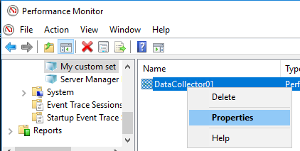

# Description
a Powershell wrapper to evaluate Perfmon-recorded CSV-data and turn it into Munin-readable 
multigraph / supersampling format.

# Features
- high sampling rate 
  - one data point every 15 seconds with the defaults
  - configurable down to the minimum 1-second-interval supported by Munin
  - configurable for Munin collection intervals of longer than once per 5 minutes, retaining the high data resolution
- multiple datalines in one graph
- configurable scaling
- pre-defined collection templates

Get high-resolution data into Munin now!

| perfmon2munin collected disk performance data | vs | Munin Node for Windows native disk performance plugin |
| ------- | --- | ------- |
|  | |  |

# Requirements
Requires a configured recent (1.7.3 or newer) version of _Munin Node for Windows_ from the 
[munin-node-win32 repository](https://github.com/munin-monitoring/munin-node-win32/releases)

# Installation
Running `install.bat` with administrative privileges will 
- copy the plugin scripts and configuration files to `C:\Program Files\Munin-Node-Plugins\perfmon2munin`
- register the external plugin _"perfmon2munin"_ in _munin-node.ini_
- use the sample data collector sets from the _Perfmon-Templates_ directory to set up 
  data collection for a number of services (if present on the machine)

# Configuration
## adding new graphs

If you want to add more graphs or alter the data sources of the predefined ones, you can do so by adding / editing
_User Defined Data Collector Sets_ in perfmon:

When adding new collector sets, make sure to set the following parameters:
1. Create a new data collector set with advanced options. The name you give the set will be the name 
   of the graph in Munin.
    
   
2. Choose _Create data logs_ and check _Performance counter_ as the only option
   
   
3. Add the desired performance counters and change the sample interval, if necessary
   
   
4. edit the created Data Collector's properties, set the log format to _"Comma Separated"_
    
   
   
   
5. add a schedule to the Data Collector Set's properties

    
6. make sure the data collector set restarts once a day

   

7. start the data collector set

   

## plugin configuration options
The plugin uses two additional configuration files to draw definitions from:

### perfmon2munin-viewscale.conf
contains a single JSON key:value hashtable where 
"key" is the perfmon value name to define a viewscale for and "value" is the
unit multiplier to use for Munin data display

Example:

    {
           "PhysicalDisk(_Total)\\Disk Bytes/sec":  "1e-6"
    }
would configure a CDEF multiplying the values provided with 10^-6, effectively 
showing them as Megabytes in Munin graphs. Note that the transmitted data itself
is unaffected by this definition - it still would contain the raw byte value.

"Nice" SI metric prefix names (like "milliunits" or "Teraunits") are defined for a number of scale definitions and appended to the
counter descriptions in Munin.

### perfmon2munin-gauges.conf
contains a JSON array with a number of string
entries defining whether counters should be interpreted as point-in-time GAUGEs instead of
as ever-incremented COUNTERs, where delta values between measurements are calculated 
and normalized by the time passed inbetween measurements.

The default is to return all data as COUNTERs, except for those counter names regex-matched by one 
of the entries in the `perfmon2munin-gauges.conf` file.

# Related work
* The original PerfCounterPlugin for Munin Node for Windows https://github.com/munin-monitoring/munin-node-win32
  * requires no additional installation - is already present with every _Munin Node for Windows_ installation
  * does not support supersampling / returns only a single value per poll, thus limiting data resolution to the polling interval
  * does not support more than one data line per graph

# Author
Denis Jedig

on behalf of: Cologne University of Applied Sciences (TH Köln), Germany

2017-02-20
